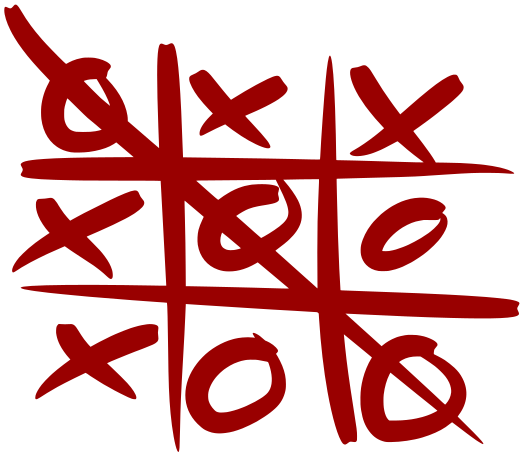

<h1 align="center">Jogo do Galo (Tic-Tac-Toe)</h1>

    

  
  

Academic Work - Computer Network

Project report can be consulted in JogoDoGalo.pdf

## Game History

Tic Tac Toe is a popular game and pastime. It is a game with extremely simple rules, which does not cause great difficulties for its players and is easily learned.

The origin may have started in ancient Egypt, where boards carved into the rock were found, which would have been more than 3,500 years old.
The game may have been born in Portugal, in the city of Almada in the year 545, however, it was only popularized in the year 1500, by the discoverer Pedro Álvares Cabral, who loved to play this game during his travels.

Álvares Cabral will have decided that this game would be the first to be taught to the indigenous people in Brazil.

Analyzing the number of possibilities in a simplistic way, there are 362,880 ways to arrange the cross and the circle on the board, without considering winning moves.
When we consider the winning combinations, there are 255,168 possible games

## Game Concept

The concept of the game is not based on its gameplay as an entertainment game, but on the study carried out on a technology that supports the Java RMI platform, facilitating the development of distributed applications.

To learn more about Java RMI [click here](https://docs.oracle.com/javase/7/docs/technotes/guides/rmi/hello/hello-world.html)

## 📝 Licence

This project uses the MIT [License](https://github.com/git/git-scm.com/blob/master/MIT-LICENSE.txt)

---

Created with 💜 by <a href="https://www.linkedin.com/in/eduardoqueiros/">Eduardo Queirós</a> 👋
